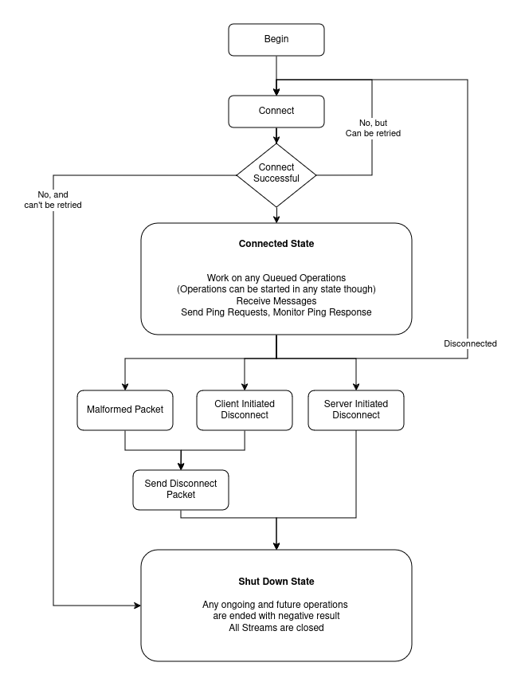
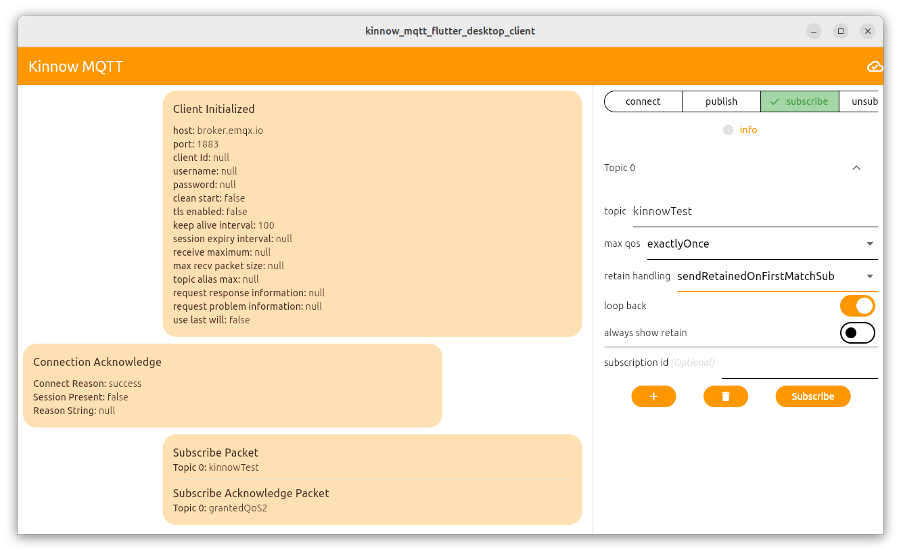

# Kinnow MQTT 🍊

A Mqtt 5 Client for dart. Key features include

### 1. Lifecycle Management
The Kinnow Mqtt Client will retry on automatically retry connection if it fails. It will also reconnect if the connection breaks after reconnection. The lifecycle is explained in detail in a later section.

### 2. Detailed insights
Kinnow Mqtt client functions will return any corresponding acknowledgement packets. For example calling subscribe will return the SubAck Packet sent by the broker, A publishQos1 call will return the PubAck. For events that occur without any calls such as ping requests and ping response, An event stream is provided

### 3. Built for Unreliable Networks
The library is built with unreliable networks in mind. The client ensures that operations are completed regardless of connection state. This means the user doesn't need to monitor the connection status before starting any operation

## Client Lifecycle

## What's with the name?
Kinnow (pronounced kee-noo) is a fruit grown in Pakistan and India. Its a specie of orange, but is a bit less tangy and more pulpy.

## Desktop Mqtt Client Demo Application

To quickly evaluate Kinnow Mqtt, check out the Kinnow Mqtt flutter demo application located in the directory `example/kinnow_mqtt_flutter_example`. A snap package for linux is also available in the releases section
The demo application has the following features. 
1. Implements many of the advanced features of MQTT5, and can be used to test them
2. The codebase showcases how Kinnow Mqtt may be implemented in a flutter application
3. The app can be used to evaluate how Kinnow Mqtt handles connections, disconnections etc.

## Roadmap
1. Adding support for Websockets
2. Implementing Authentication Packets
3. Handling Server initiated disconnections

## Contributing
The project is still in its initial stages and needs your help!!. If you face any issue, please do report it. If you have any feature request, also mention it in the issues.